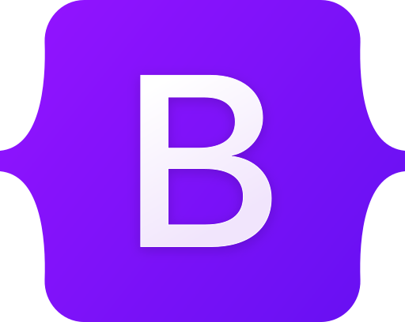
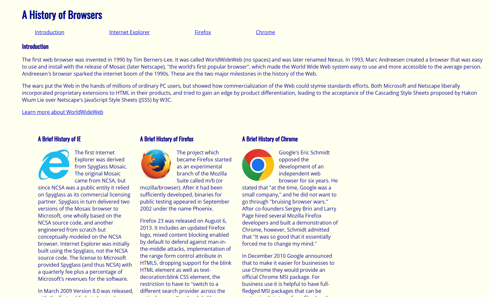
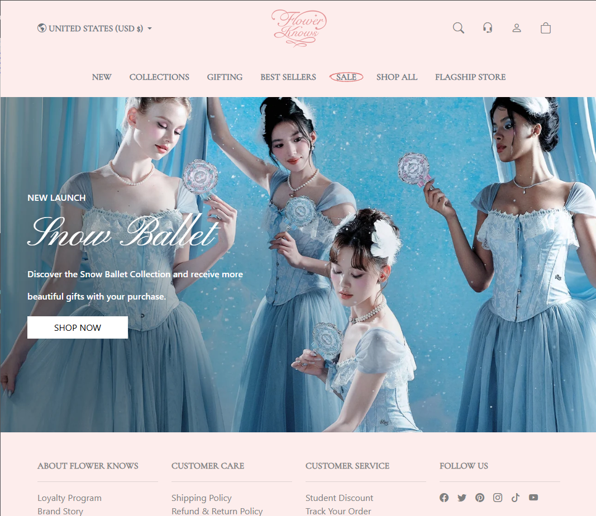

Today's web users demand flawless, responsive digital experiences, expecting an application to adjust seamlessly whether viewed on a large laptop monitor or a small smartphone screen. Behind this illusion of effortless adaptation lies a core secret of modern web development known as User Interface (UI) frameworks. Rather than writing thousands of lines of raw and fragile CSS code to accommodate every device and layout, software engineers rely on UI frameworks. These frameworks eliminate tedious boilerplate code, accelerate development workflows, and ensure visual consistency across large-scale projects. Among many front-end tools, Bootstrap stands out as a framework that transformed responsive layout design from manual effort into an industry standard.

## What is Bootstrap?

Bootstrap is an open-source front-end framework that was originally developed by Twitter engineers in mid-2010. The goal was to promote consistency across internal tools before being released to the public. This framework was designed to provide developers with a robust responsive grid system, pre-designed UI components (navbars, cards, modals, buttons), and utility classes for rapid layout manipulation. By offering cross-browser compatibility, Bootstrap allows front-end developers to assemble structured, visually polished user interfaces more efficiently than traditional CSS development.

## Bootstrap vs. Raw HTML and CSS

Before taking my college software engineering course, I had no prior experience to front-end development tools. It was within this course that I gained my first hands-on practice crafting web interfaces strictly with raw HTML and CSS.

Naturally, before adopting a UI framework, I needed to master these fundamental building blocks. While learning HTML was straightforward, familiarizing myself with the vast array of available elements required significant time and effort. Navigating subtle distinctions between elements also required a shift in mindset. For example, understanding when to use a `
` versus a `<section>` presented an initial challenge. While both group elements together, a `
` serves as a generic wrapper for positioning and styling elements side-by-side, whereas a `<section>` semantically categorizes thematic content. Determining the appropriate context for generic versus semantic markup was one of my hardest learning hurdles.

Similarly, CSS concepts were approachable, but retaining its extensive catalog of styling properties was initially overwhelming. I found that keeping official documentation open alongside my code editor significantly streamlined the learning process. Actively experimenting with different properties and observing their real-time visual impact confirmed my understanding, helping me recognize how to strategically apply these styles in future projects.

Through persistent practice, my confidence in writing core HTML and CSS grew substantially. The figure below showcases an assignment from my software engineering course, featuring a web page designed exclusively with raw HTML and CSS.

Building upon my foundational understanding of HTML and CSS, transitioning to Bootstrap 5 was a natural progression. Bootstrap's intuitive utility classes allowed me to structure complex, responsive layouts far more efficiently, eliminating the need to write dozens of lines of custom CSS.

Initially, adopting this framework posed a learning curve due to the vast spectrum of available styling classes. Just as with raw CSS, keeping Bootstrap's official documentation nearby was essential for learning how to apply styles directly without relying on custom stylesheets. Through repeated practice across my software engineering assignments, I quickly grew accustomed to class declarations, gaining precise control over layout formatting to build clean, user-friendly interfaces.

However, working with the framework introduced a few notable drawbacks. Relying heavily on Bootstrap for styling creates a dense network of utility and component classes, which can clutter HTML markup and make code difficult to read or maintain over time. As a beginner, it was particularly easy to get lost within nested `
` structures laden with numerous utility class names.

Conversely, the advantages of Bootstrap 5 far outweighed these initial hurdles. Development efficiency increased significantly because styling occurred directly within the markup, eliminating constant context-switching between separate HTML and CSS files. Furthermore, its built-in responsive breakpoints effortlessly scaled content across mobile devices, tablets, and desktop displays.

Ultimately, incorporating Bootstrap into my workflow was both rewarding and transformative, drastically accelerating my development process while simplifying front-end design. The figure below showcases a project built using Bootstrap 5, in which I designed a responsive clone of a subset from the Flower Knows company website.

## Overall View on Bootstrap and UI Frameworks

Ultimately, my experience with leveraging UI frameworks like Bootstrap 5 demonstrates more effectiveness for modern, larger-scale projects than relying strictly on raw HTML and CSS. These frameworks serve as invaluable assets for software engineers, enabling developers to rapidly build accessible, mobile-ready applications. Moving forward, I intend to utilize Bootstrap for future web development projects, particularly those that demand structural consistency and development speed. While mastering foundational HTML and CSS remains crucial for every developer, I strongly recommend that anyone learning front-end development adopt a framework like Bootstrap to streamline their workflow and elevate both their design skills and technical standards.

## AI Usage
I utilized Google Gemini to help me with grammar checking and to generate ideas for an engaging hook to my essay. Additionally, Gemini assisted me with defining Bootstrap and UI frameworks, making sure that they were described with high-level wording.