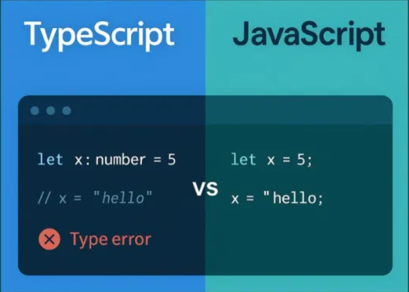

## Here's What I Learned about Typescript

TypeScript is essentially JavaScript with a built-in safety barrier. By adding static typing, it allows you to explicitly declare what kind of data a variable, function parameter, or object should hold. Initially, I thought learning it would be incredibly complex given the huge number of tutorials I had to complete. However, as I worked through the examples, I realized just how accessible it is. I found Typescript both challenging and straightforward. Its syntax closely mirrors C++, a language I’ve used in previous programming courses, which gave me the confidence to pick it up quickly.

The most valuable lesson I took away is how TypeScript actively enhances JavaScript by catching mistakes before they happen. Because you explicitly define your types, the compiler immediately throws an error if a value doesn't match expectations. For example, consider the code comparison in the image below.

In standard JavaScript, there is no safety check: you can initially assign the variable x to a number (5), and later reassign it to a string ("hello") without the program ever complaining. TypeScript, however, immediately throws a type error if you attempt to assign "hello" to x, because it was explicitly declared as a number on the first line. Ultimately, this strictness helps keep your code happy, healthy, and safe.

## Racing Against the Clock: Athletic Engineering

Athletic Engineering is a learning method that treats programming like sports training—focusing on speed, repetition, and problem-solving under time constraints. I genuinely enjoyed the WODs where we had to time ourselves to see how efficiently we could write a working solution within a specific timeframe. Alongside the WODs, the practice and real quizzes served as excellent exercises to sharpen my skills and build my proficiency in TypeScript. Overall, I really appreciate this style of learning and look forward to tackling upcoming topics with this same high-energy approach.

## Overall View on Typescript

Overall, from a software engineering perspective, I think TypeScript is an invaluable tool. When working within complex codebases, it is easy to accidentally assign the wrong type of data to a variable. If a language isn't built to detect these mismatches, the program will continue to run as if everything is normal. This leaves you with broken logic and the grueling labor of hunting down a silent bug hidden inside hundreds of lines of code. By catching these errors instantly, TypeScript prevents those headaches before they even start.

## AI Usage
I utilized Google Gemini for this essay to checking for an grammatical errors and to organize my thoughts to structure concise, readable paragraphs.
