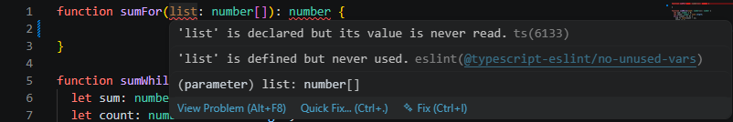
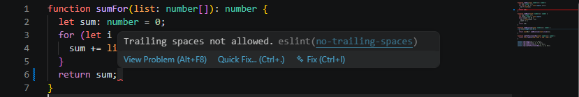

  

Imagine building a skyscraper where every architect uses a different unit of measurement, every carpenter chooses their own blueprint style, and every electrician uses whatever color wires they happen to like. That is precisely what a codebase looks like without coding standards.

## The Purpose of Coding Standards

Coding standards in software engineering are a set of guidelines, rules, and best practices that programmers follow to write high-quality code. Let's refer back to the analogy from earlier. If one architect designs using feet measurements while another architect on the same project works exclusively with inches, coordination falters and critical structual mismatches could inevitably compromise the final design. In software engineering, when a developer write dense, unformatted code such as omitting indentations or line breaks between functions, it creates a huge bottleneck for their teammates. Instead of spending time implementing new features or resolving bugs, other engineers waste time and effort deciphering and reformatting the basic logical structure. This is precisely where coding standards step in, establishing strict rules that every team member must follow.

When an entire team commits to consistent coding standards, code becomes significantly easier to read, navigate, and maintain. Even small stylistic choices such as adding a single line break between two functions impacts how efficiently engineers collaborate to build and deploy a polished product. To support these standards, developers rely on automated static analysis tools. One of these tools is ESLint, where I will go through what I experienced firsthand.

## My Experience with ESLint

ESLint is an open-source static code analysis tool. This is a linter primarily used in JavaScript and TypeScript development. It scans code without running it to detect syntax errors, potential bugs, security vulnerabilites, and formatting inconsistencies.

This past week, I experienced using ESLint while developing programs. As you write code, the linter will begin to show errors indicated by a red squiggly underline. When you hover over them, they will describe the error with a popup message. For example, take a look at an excerpt from my code.

  

As you write out a function in TypeScript, you'll notice a red squiggly lines underneath the parameter `list`. When you hover over it, a popup message describes the error analyzed by the linter. This error occurs because `list` was declared but never used inside the function. We can fix that by implementing the function shown below.

  

Now the parameter `list` doesn't show the error anymore. However, now there's a red squiggly line right after the last semicolon. The popup message when you hover over it states that this error occurs because there's a trailing space right after the semicolon. Even small formatting mistakes like an extra space can cause the linter to yell at you. To fix this, all we need to do is delete the space, and the linter becomes happy. 

## Overall View on Coding Standards and ESLint

There are way more errors than the ones I talked about earlier that the linter will scream at you for. This includes strict indentation spacing, having one blank line between lines of code, and general syntax errors. Through my experience, I found ESLint to be fairly helpful while developing. You don't need to run the code to see the errors, it shows on your developing platform for you. If you have huge blocks of code with a bunch of errors, you don't need to manually find every error. By running `npm run lint` in the terminal, it shows all the errors within the program and what line they're located on. 

I classify myself as a perfectionist, which adds to the reason of why I enjoyed using ESLint because seeing all those errors disappear gives me reassurance that my code is clean and error-free. 

Overall, I plan to utilize this tool more often when developing in JavaScript/TypeScript, and I definitely encourage any software engineer, even beginners, to do the same!

## AI Usage
I utilized Google Gemini to help me with grammar checking and to generate ideas for a creative title and hook. Additionally, I typed out my paragraphs with the sentence structure and information I wanted, then fed the paragraphs into Gemini to help me refine my text to reduce redundancy.