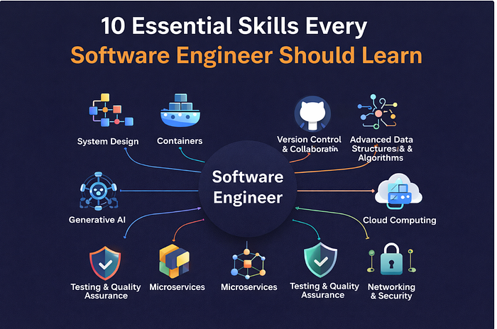
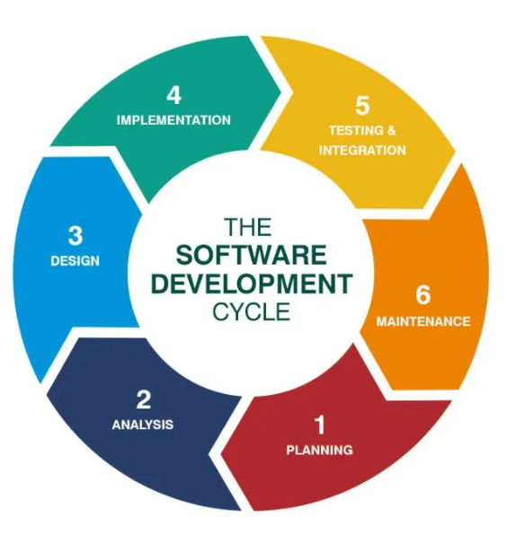

  

Hello, World (of Software Engineering)!

First off, lets get the most important question out of the way... 

## What is Software Engineering?

According to GeeksforGeeks, **software** is a set of instructions instructions that provides specific functionality, while **engineering** is the process of designing and building products that serves a purpose efficiently and cost-effectively. Combining these two terms gives us **Software Engineering**: the process of designing, building, testing, and maintaining software applications and systems to ensure these programs are functional, reliable, efficient, and cost-effective. 

To achieve this, software engineers rely on the **Software Development Lifecycle (SDLC)**. SDLC is a structured framework for managing a software project from beginning to end, ensuring the software is consistent, efficient, and high-quality. The SDLC follows 6 key phases: Planning, Analysis, Designing, Implementation, Testing & Integration and Maintenance. 

  

## What Makes Software Engineering So Interesting?

Software Engineering goes far beyond simply writing code. This field encompasses a wide spectrum of specialized roles, each with their own set of responsibilities. Some common types of software engineering roles include frontend engineer, backend engineer, application developer, architect, project manager, and so much more.

Now, why am I interested in Software Engineering? 

My first reason is my goal to learn new programming languages. Having taken several courses in Electrical and Computer Engineering, my background is mostly limited to Python and C/C++. Through my current Software Engineering course, I am in the midst of learning to write in Typescript, which is proving to be very fun but also very challenging as a newbie. 

Another reason for my interest is the variety of technical skills you can learn for engineering professions. These skills can include system designing, cloud computing, networking & security, data structures & algorithms, and much more. I personally want to learn as many technical skills as I can and apply these skills in practical real-life applications to help build or support a products for users.

## Leveling Up As An Engineer

I want to expand my technical skills and knowledge of engineering as much as I can. As technology rapidly evolves, the demand for adaptable, well-architected software grows with it. Stepping into software engineering means embracing the discomfort of constant learning. It’s about stepping out of my comfort zone to keep pace with an advancing field.

So, let's begin: Hello, Software Engineering!

## AI Usage
I utilized Google Gemini to help make this essay sound more concise. I tend to spew out my thoughts and ideas when typing out paragraphs, so AI was a useful tool to structure my thoughts to help me write out this essay.

