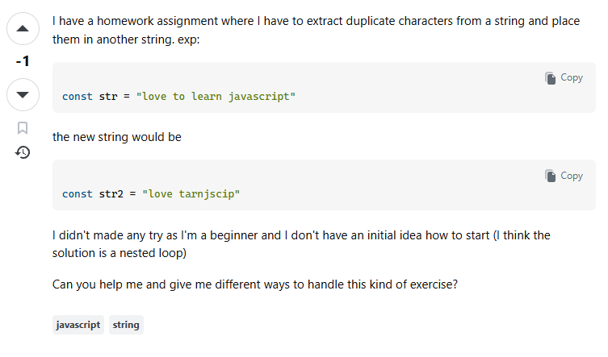
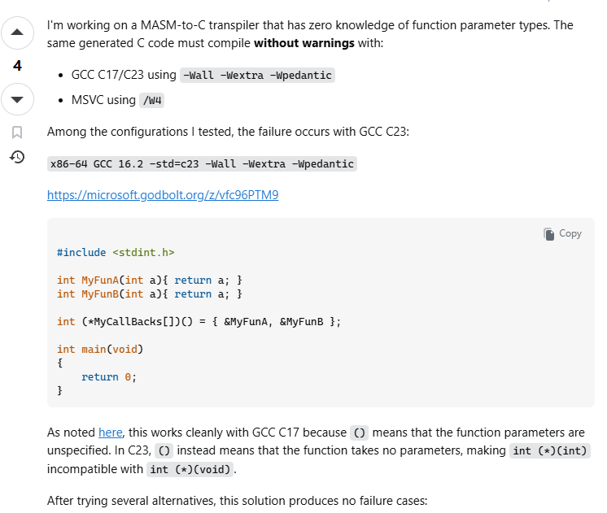
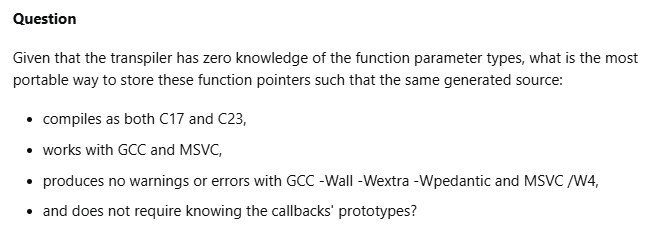

## Before You Start Asking
Don't immediately ask for help the moment something goes wrong. Instead, cultivate a mindset geared toward learning, problem-solving, and independent research. Before reaching out to experts with a technical question, exhaust your own resources to find a solution. Chances are, a forum or documentation page already contains the exact answer you need. Putting in this initial effort demonstrates your perseverance and a genuine drive to understand not just what the fix is, but how it works. If your research still leaves you stuck, it is time to ask for help, but you must ask in the "smart" way. Let's illustrate the difference between a not smart question and a smart question using the following examples.

## "Smart" Question vs. "Not Smart" Question

Let's look at an example of a "not smart" Stack Overflow question, shown in the image to the left. First, the user opens by saying, "I have a homework assignment..." When asking for technical help, you shouldn't just post your homework assignments. Those exercises are specifically designed to teach you how to problem-solve.

Secondly, the user admits they haven't tried any solutions because they are a "beginner" with "no initial idea how to start." This shows a lack of initiative. To grow as a programmer, you have to use the resources around you—like professors, classmates, or the internet—to at least attempt a fix. While this post did happen to get a few helpful responses, it is a perfect example of how not to ask a technical question. If you don't face challenges head-on and try to find the solution yourself, you aren't really learning anything.

This question does have a few responses that offer a solution for the user, but this example shows how we should not be asking technical questions. Learning comes from experiencing the challenges head on, and if no attempts are made to try to find the solution, then you won't really be learning anything.

Source: [Stack Overflow](https://stackoverflow.com/questions/76677968/extract-duplicate-characters-from-a-string)

Now, let's switch over to an example of a "smart" question, shown in the image above. Right away, the user clearly explains their project and the specific problem they want to solve. They also mention that they’ve tested multiple configurations, pinpointing exactly where the issue originates and under what conditions the code actually works.

The next image above shows the actual question being asked. The formatting makes it incredibly easy to read because the user provides specific details about their desired outcome. Because the user was clear, concise, and upfront about the methods they already tried, the community's responses were much more detailed and genuinely helpful.

Source: [Stack Overflow](https://stackoverflow.com/questions/80001459/c17-vs-c23-function-pointer-error-is-this-the-correct-fix)

## How Will This Help Me As A Software Engineer?

Analyzing these examples completely changed how I view asking for help. I learned that a smart question isn't just a cry for a quick fix; it's proof that you’ve already put in the work. By taking the time to research, test things out, and clearly explain exactly where I'm stuck, I can turn a frustrating roadblock into an insightful conversation. I also realized why Stack Overflow strictly closes questions that violate their guidelines (e.g. asking homework questions without attempting the problem). This strictness filters out low-effort posts and highlights the good technical questions that actually need an expert's input. Ultimately, asking smarter questions leads to faster, higher-quality answers that challenge us to learn, expand our knowledge, and see new perspectives on problem-solving.

## AI Usage

I utilized Google Gemini to check for grammatical errors and to highlight the important points from Eric Raymond's [How To Ask Questions The Smart Way](http://www.catb.org/esr/faqs/smart-questions.html).

