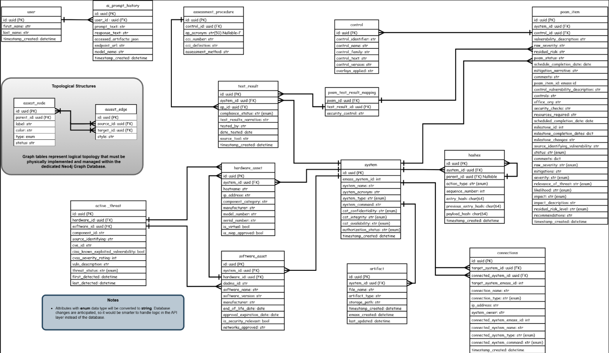

<div class="text-center p-4">
  
</div>

The Autonomous Cyber Readiness Evaluator, or Project ACRE, is a multi-developer initiative focused on engineering an autonomous, AI-driven platform to fully automate the legacy manual, paperwork-heavy 6 step Risk Management Framework (RMF) process. During this development phase, the system operated as a prototype requiring key feature implementations to meet its Minimum Viable Product (MVP) scope. The main focus was on closing these functional gaps to ensure the software was fully prepared for upcoming Navy pilot testing.

As a Backend Engineer Intern on Project ACRE, I designed and implemented the foundational relational database architecture required to advance the system from prototype to MVP status. I began by analyzing system requirements to identify essential Risk Management Framework (RMF) entities and artifacts (such as POA&Ms and SARs) and created an Entity-Relationship Diagram (ERD) to model data structure and enable automated artifact generation. Finally, I translated this ERD into functional code by writing Python scripts using SQLAlchemy and Alembic, establishing database schemes, object-relational mappings, and automated migration workflows to support future scalability.

This experience expanded my technical capabilities in database design, data modeling, and schema migration strategies. Designing an ERD for a defense-focused application provided deep insight into the complex data requirements needed to generate military RMF artifacts. Using Python libraries like SQLAlchemy and Alembic, I learned how to translate visual relational models into structure code while building repeatable, version-controlled migration files to safeguard against future database changes/errors. This project established a strong foundational framework for how I will architect, document, and scale relational databases in future software engineering projects.

Here is some code that illustrates how we read values from the line sensors:

```cpp
byte ADCRead(byte ch)
{
    word value;
    ADC1SC1 = ch;
    while (ADC1SC1_COCO != 1)
    {   // wait until ADC conversion is completed   
    }
    return ADC1RL;  // lower 8-bit value out of 10-bit data from the ADC
}
```

You can learn more at the [UH Micromouse News Announcement](https://manoa.hawaii.edu/news/article.php?aId=2857).
