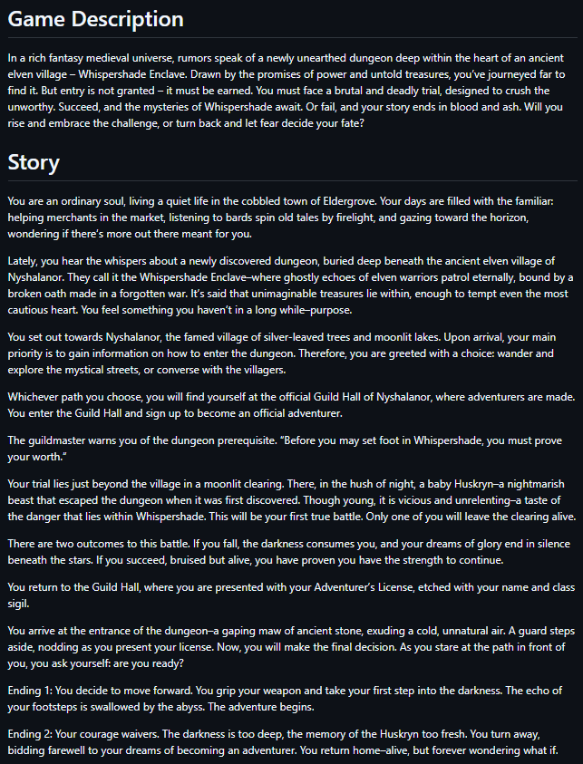

This project was a beta-stage RPG designed to demonstrate core object-oriented programming (OOP) concepts in software engineering. The program models game entities such as players, enemies, and items) using modular classes and objects. It features typical core RPG mechanics like turn-based combat, character stats management, and state tracking.

As a solo developer on the project, I worked on designing and implementing core software modules, focusing on class architecture and system interactions. My focused work included establishing the base character class hierarchy, managing dynamic state transitions during gameplay, and implementing object-oriented design patterns. I implemented many classes such as profession classes, a player character class, abilities that each profession had, and much more.

This experience strengthened my practical understanding of OOP design, specifically leveraging inheritance, polymorphism, and encapsulation to build a maintainable codebase. I gained hands-on experience in managing complex game loops, debugging edge cases in dynamic state tracking, and writing logic that accommodates future feature expansions.

Source: [GitHub](https://github.com/leihanitaylortabanera/ece205-lab14a-RPG-beta-Lei2024)

